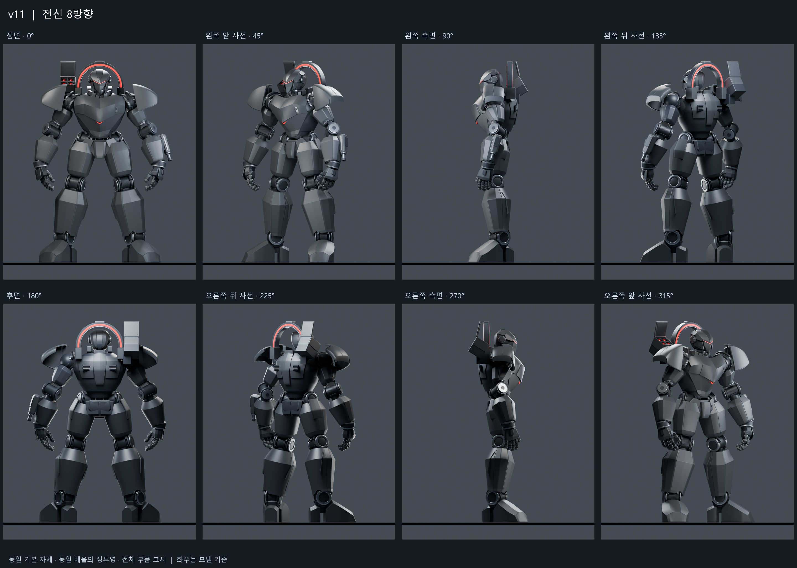

# 65m 보스 모델링 v11

현재 보스 모델링 원본은 **Boss_v011.blend**입니다. 기존 `ArtSource/BossV01`~`BossV08`에 이어, 손·흉갑·연결부 수정과 최종 발 수정을 포함한 전신 모델을 보관합니다.

## 열기

Blender 5.2.2 LTS에서 [Boss_v011.blend](Boss_v011.blend)를 엽니다. 기본 저장 상태는 중립 자세인 **201프레임**, `HERO` 카메라, 모든 모델 메시 표시 상태입니다. 파일 안에 편집 가능한 모델, 재질, 카메라와 기존 동작 검수용 제어가 포함되어 있습니다.

이 파일은 모델링 및 동작 검수용 Blender 원본입니다. Unity용 FBX, 프리팹, 게임 동작이나 최적화된 런타임 에셋은 이 폴더에 포함되지 않습니다. 기존 Unity 프로젝트의 씬과 임포트 설정을 변경하지 않고 `ArtSource`에서 관리합니다.

## 미리보기

- [대표 전신](boss_preview.png)
- [발 7방향](feet_7_views.png)
- [발 수정 전후](before_after_feet.png)
- [첫 v11 시안과 최종 수정본 비교](iteration_before_after.png)
- [레퍼런스와 실제 모델 비교](reference_comparison.png)
- [연결부](connection_review.png), [클레이](clay_review.png), [가동 자세](motion_checks.png)
- [전신 맥락](full_body_context.png)

합성 검수 이미지와 검사 기록을 함께 보관했습니다. 원본 개별 렌더 모음, 비교용 v10 파일, 생성 레퍼런스 원본 및 ZIP 묶음은 이 폴더에 포함하지 않았습니다. 검수보고서에는 제작 중 사용한 해당 자료의 이름도 등장합니다.

## 주요 상태와 검수 범위

- 높이 약 65m, 모델 메시 646개, 평가 후 삼각형 1,160,428개입니다.
- 발은 큰 앞발과 작은 뒤꿈치, 두 접지 패드 사이의 실제 빈 공간, 위로 들어 올린 내부 연결부로 구성했습니다. 앞코 폭을 줄이고 발등을 높인 최종 수정본입니다.
- 기존 제어/부착 노드 76개와 검수 동작 281프레임을 보존했습니다. 그중 `CTRL_` 이름의 직접 제어는 55개입니다. 새로운 독립 앞발가락/뒤꿈치 관절은 추가하지 않았습니다.
- 기존 검수 기록에서 발 연결부 22개와 발목 상부 부착 4개는 반 프레임 간격 561자세에서 이탈 0건입니다. 수정된 발·발목의 표면 교차는 검사한 281프레임과 추가 11자세에서 0건입니다.
- 손가락과 정강이의 일부 접촉, 깊은 무릎 굽힘에서의 기존 접촉은 남아 있습니다. 모든 동작의 충돌 해결, 보행 접지, Unity 리깅/애니메이션 또는 VR 성능 검증을 완료한 상태는 아닙니다.
- 레퍼런스 비교는 추정 카메라 방향과 균일 배율을 사용한 검수이며, 픽셀 단위 일치를 뜻하지 않습니다.

상세 변경 내용과 한계는 [검수보고서](검수보고서_KO.txt)를 참조하세요. 함께 있는 JSON은 기존 모델링 검수 결과입니다. 이번 Git 반입에서는 원본과 복사본의 SHA-256 일치 및 반입 파일 목록을 확인했습니다.

## 파일 식별

원본 파일명: `boss_65m_revision_11.blend` → 저장소 파일명: `Boss_v011.blend`. 내용은 동일합니다.

SHA-256: `8c661557e82cbcd0f91230522497c25a403672f9909f6859fdb9e28174ff1111`
